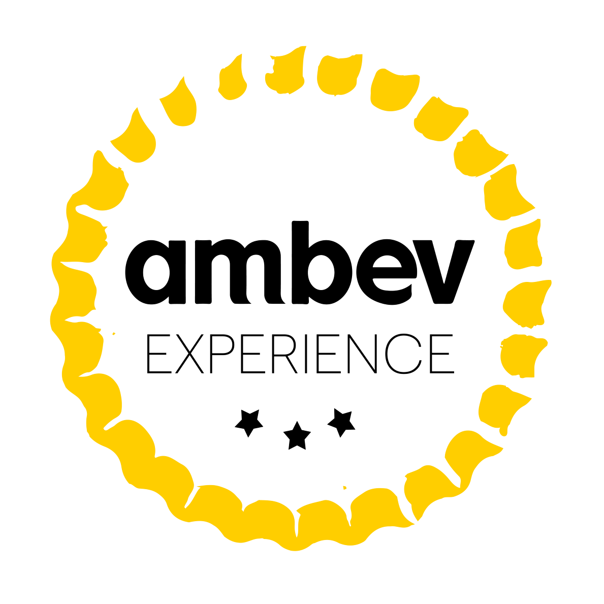
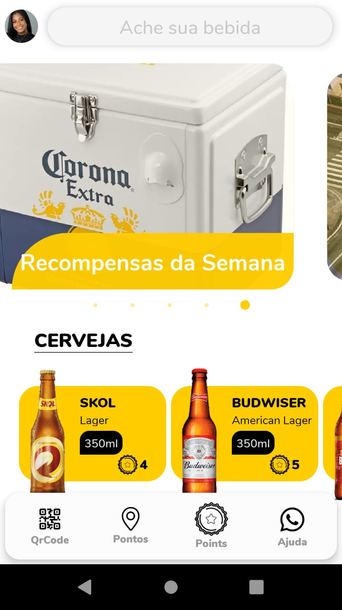

<p align="center">
  <a href="" rel="noopener">
 </a>
</p>

<h3 align="center"></h3>

<div align="center">

[]()
[](https://github.com/viniciusraja/MegahackAmbev/issues)
[](https://github.com/viniciusraja/MegahackAmbev/pulls)
[](/LICENSE)

</div>

---

<p align="center"> Protótipo de App realizado em menos de uma semana no desafio da Hackaton MegaHack 3.0
    <br> 
    App prototype made in a week for a Hackaton.
</p>

<p align="center">
  <a href="" rel="noopener">
 </a>
</p>

## 📝 Table of Contents

- [About](#about)
- [Getting Started](#getting_started)
- [Built Using](#built_using)


## 🧐 About <a name = "about"></a>

<p align="justify">
Aplicativo Ambev Experience possuí uma visão ambiental focado num programa de fidelização dos clientes por meio de recebimento de pontos ao reciclar latinhas, fora implementado leitura de QrCode, para verificar a quantidades de pontos por latas recicladas. Também foi desenvolvido um mapa, que exibia com ícones costumizados as localizações dos pontos de reciclagem ao redor do Brasil, os pontos eram recebidos através de uma chamada a API utilizando Redux para gerenciamento de estados e o redux-thunk como criador de ações, para lidar com ações assíncronas.
</p>

## 🏁 Getting Started <a name = "getting_started"></a>


### Executando o APP

Você poderá executar o Ambev Experience por meio do App do Expo, basta escanear o QrCode abaixo com o App Expo, que pode ser encontrado na PlayStore.

Você também poderá executar o app por meio do navegador com o link abaixo:
https://expo.io/appetize-simulator?url=https://expo.io/@viniciusraja/megahack-ambev-experience


O QrCode também pode ser encontrado no link abaixo:
https://expo.io/@viniciusraja/megahack-ambev-experience

<p align="center">
  <a href="" rel="noopener">
 </a>
</p>


### Crie sua conta ou entre nesta conta teste
``` 
    email: maria@gmail.com
    password:12345
```    
### QrCodes Mockados Para uso no App
Abra o Scan no seu AmbevExperience após logar na sua conta e escaneie os QrCodes Abaixo

### QrCode para ganhar pontos com reciclagem
<p align="center" >
  <a href="" rel="noopener" margin-right=10>
 
 </a>

</p>
<p align="center" >
  <a href="" rel="noopener">
 
 </a>
</p>


### QrCode com anúncio
<p align="center" >
  <a href="" rel="noopener" margin-right=10>
 
 </a>


## ⛏️ Built Using <a name = "built_using"></a>

- [React Native](https://reactnative.dev/) - React Native is a JavaScript framework for writing real, natively rendering mobile applications for iOS and Android.
- [Expo](https://docs.expo.io/) - Expo is a framework and a platform for universal React applications.
- [Redux](https://redux.js.org/) - Redux is a predictable state container for JavaScript apps.


